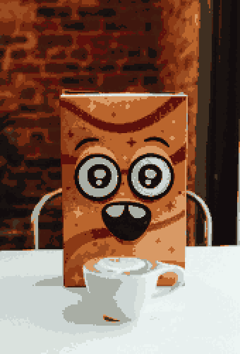

# Simple Pixelate

Command-line utility that pixelizes images to create pixel art. Inspired by [pyxelate](https://github.com/sedthh/pyxelate), but for Node.

## Examples

- `--colorLimit 16 --scale 0.5 --afterScale 2`

  -  
  - [Photo source](https://unsplash.com/photos/a-cup-of-coffee-sitting-on-top-of-a-white-table-McEh5jAOD3w)

- `--colorLimit 2 --ditherAlgo atkinson --contrast -0.09 --grayScale true`

  -  
  - [Photo source](https://unsplash.com/photos/grayscale-photo-of-topless-man-JiSjwGZ-1nA)

- `--ditherAlgo floyd`

  -  
  - [Photo source](https://unsplash.com/photos/a-lone-tree-in-the-middle-of-a-snowy-field-zrxHB6gcO0g)

## Install

1. Install [Nodejs](https://nodejs.org/en) or equivalent

2. Clone this project
   `git clone https://github.com/thinknathan/node-simple-pixelate`

3. Install dependencies
   `npm i`
   or
   `yarn`

4. Install for command-line usage
   `npm link`

## Usage

- Process a file:

  - `px -f myImage.png`

- Get all available options:

  - `px --help`

- Valid input formats: `jpeg`, `png`, `bmp`, `tiff`, `gif`
- Output format is `png`

### Options

- `filename` (-f):

  - Purpose: Specifies the input image filename.
  - Use Case: Useful when you want to process a single specific image.

- `folderPath` (-i):

  - Purpose: Specifies the input folder containing multiple images.
  - Use Case: Useful when you want to process multiple images in a batch, and the images are stored in a specific folder.

- `scale` (-s):

  - Purpose: Scales the image up or down by a factor.
  - Use Case: Allows you to resize images to a desired scale, useful for adjusting image dimensions.

- `afterScale` (-a):

  - Purpose: Rescales the image up or down by this factor, as the last step.
  - Use Case: Allows you to resize the final image up, creating a blocky look that may be more pleasing than using `pixelSize`.

- `cubic` (-u):

  - Purpose: Uses bicubic interpolation instead of bilinear for initial resizing.
  - Use Case: Enables a smoother, more accurate resizing technique that is slower. Has no effect on `afterScale` which always uses nearest neighbour.
  - Default: true

- `contrast` (-x):

  - Purpose: Adjusts contrast by a value between -1 and +1.
  - Use Case: Useful for enhancing or reducing the contrast in your images.

- `pixelSize` (-z):

  - Purpose: Adjusts blockiness by pixel size.
  - Use Case: Can be used to control the level of pixelation in your output image.

- `ditherAlgo` (-d):

  - Purpose: Specifies the dithering algorithm: `floyd`, `bayer`, `atkinson`, or `none`.
  - Use Case: Dithering is a technique used to reduce color banding in images; you can choose the algorithm that provides the desired result.

- `alphaThreshold` (-t):

  - Purpose: Adjusts transparent pixels to hide/show based on threshold.
  - Use Case: Useful for controlling the visibility of transparent pixels in your image.
  - Default: 0.6

- `colorLimit` (-c):

  - Purpose: Limits the number of colors in the output image.
  - Use Case: Useful for creating images with a reduced color palette, which can be desirable for certain artistic or display constraints.
  - Default: 8

- `palette` (-p):

  - Purpose: Uses a predefined custom palette. Overrides `colorLimit`.
  - Use Case: You can choose from a variety of predefined color palettes to give your images a specific look and feel.
  - Options:

  - APPLE_II_HI
  - GAMEBOY_ORIGINAL
  - GAMEBOY_COMBO_UP
  - GAMEBOY_COMBO_DOWN
  - GAMEBOY_COMBO_LEFT
  - GAMEBOY_COMBO_RIGHT
  - GAMEBOY_A_UP
  - GAMEBOY_A_DOWN
  - GAMEBOY_A_LEFT
  - GAMEBOY_A_RIGHT
  - GAMEBOY_B_UP
  - GAMEBOY_B_DOWN
  - GAMEBOY_B_LEFT
  - GAMEBOY_B_RIGHT
  - GAMEBOY_POCKET
  - GAMEBOY_VIRTUALBOY
  - TELETEXT
  - BBC_MICRO
  - CGA_MODE4_PAL1
  - CGA_MODE5_PAL1
  - CGA_MODE4_PAL2
  - ZX_SPECTRUM
  - APPLE_II_LO
  - COMMODORE_64
  - MICROSOFT_WINDOWS_16
  - MICROSOFT_WINDOWS_20
  - PICO_8
  - MSX
  - MONO_OBRADINN_IBM
  - MONO_OBRADINN_MAC
  - MONO_BJG
  - MONO_BW
  - MONO_PHOSPHOR_AMBER
  - MONO_PHOSPHOR_LTAMBER
  - MONO_PHOSPHOR_GREEN1
  - MONO_PHOSPHOR_GREEN2
  - MONO_PHOSPHOR_GREEN3
  - MONO_PHOSPHOR_APPLE
  - APPLE_II_MONO
  - MONO_PHOSPHOR_APPLEC
  - APPLE_II_MONOC
  - MICROSOFT_WINDOWS_PAINT
  - AMSTRAD_CPC
  - ATARI_2600
  - ATARI_5200
  - ATARI_7800
  - ATARI_LYNX

- `customPalette` (-o):

  - Purpose: Specifies a custom palette in the format [[r, g, b], [r, g, b], ...]. Overrides `palette` and `colorLimit`.
  - Use Case: Allows you to define your own color palette for image processing.

- `lowPass` (-l):

  - Purpose: Uses a lowpass filter to reduce noise.
  - Use Case: Useful for improving image quality by reducing noise.
  - Default: false

- `randomColor` (-r):

  - Purpose: Uses randomness when reducing the palette to colorLimit.
  - Use Case: Adds a random element to color reduction, providing variation in your output.
  - Default: true

- `normalize` (-n):

  - Purpose: Normalizes image color for consistency.
  - Use Case: Ensures consistent color representation across your images.
  - Default: true

- `grayScale` (-g):

  - Purpose: Transforms the image to grayscale.
  - Use Case: Converts your image to black and white, useful for specific artistic effects.
  - Default: false

- `width` (-w):

  - Purpose: Specifies the output image width. Overrides `scale` and `afterScale`.
  - Use Case: Allows you to set a specific width for your output image.

- `height` (-h):
  - Purpose: Specifies the output image height. Overrides `scale` and `afterScale`.
  - Use Case: Allows you to set a specific height for your output image.

## Background

Created with Chat-GPT 3.5.

## License

This repo is [CC0-1.0](LICENSE) unless otherwise specified.

`definedPalettes.ts` is adapted from [pyxelate](https://github.com/sedthh/pyxelate) and carries their MIT license.

Images in `docs` carry the [Unsplash License](https://unsplash.com/license).
